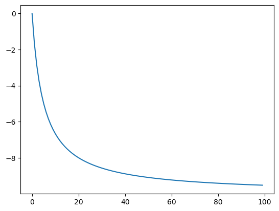
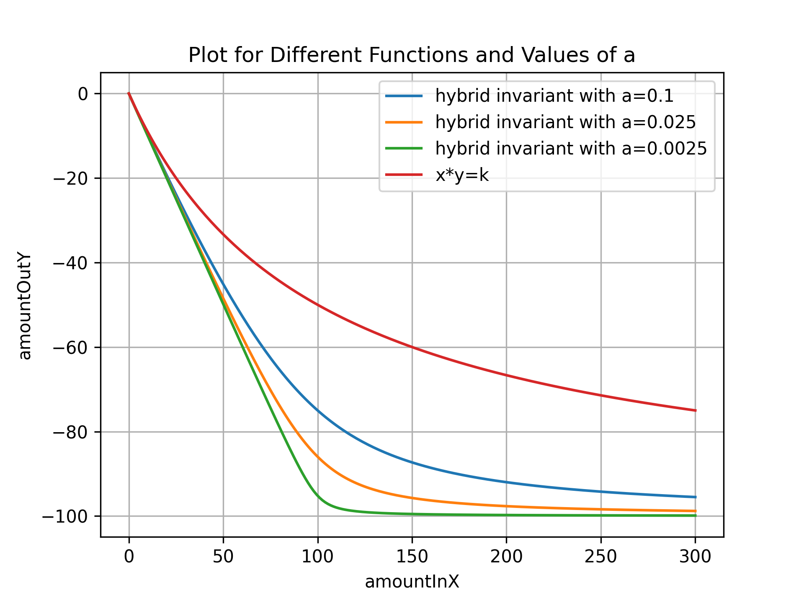

# sberAMM
Sberbank Hackathon AMM


### Notice: 
This is the repository for the Automated Market Maker designed for Sberbank during the Sberbank Blockchain Hackathon. 
The research and development of this repository was conducted by Alexander John Lee and Mikhail Bolshakov.

## Design

This repository contains smart contracts which are designed to function as a decentralized exchange (DEX). 
The traditional method of creating a smart contract that functions as a DEX is to use the standard automated market maker (AMM)
invariant curve x*y=k, where x is the amount of token x, y is the amount of token y, and k is a constant. 

The SberAMM DEX does use this invariant curve, however we go a step further by introducing a formula that enables 
minimal slippage for assets that are highly correlated, and also uses less gas during its execution on the EVM as compared 
to other Hybrid Invariant Curve AMMs such as Curve finance. 

The SberAMM DEX allows for the creation of two types of token pools. The first type are for non-correlated assets, and 
as a result we use the invariant curve x*y=k. The second type of pool is for highly correlated asset classes and uses a modified
invariant curve which within a certain range functions almost as the constant sum invariant curve x+y = k. This modified invariant curve allows for minimal slippage.

We designed the SberAMM DEX from the perspective of a bank, and as a result we allow for more administrative control over the DEX.
The deployer of the SberAMM DEX has the ability to blacklist users and pause trading of certain pools.

Users can deposit liquidy to certain pools, earn fees on their deposited assets, and withdraw earned fees. Additionally, the SberAMM DEX
has the ability to have a protocol fee, in which fees collected in the protocol fee are set to a Payment Splitter smart contract. 
The fees in the Payment splitter contract are distributed equally among the holders of the SberAMM DEX ERC-20 token. 
The SberAMM DEX token functions as an on-chain dividend paying asset, since fees earned by the SberAMM DEX are distributed proportionally
among holders of the SberAMM ERC-20 token.

The SberAMM DEX uses the PRB-V3 math library to handle floating point arithmetic in Solidity. All values are base 1e18.

All development of the smart contracts and associated front end interface were completed within the time period of the Sberbank Hackathon. 
All code and mathematical formulas are original work of Alexander John Lee and Mikhail Bolshakov.

## Standard Constant Product Function 

This swap contract uses the formula, where x is the amount of token x, y is the amount of token y, and k is a constant:

```math
{x * y = k}
```

## Calculating change in x from change in y:

From:  
```math
{x * y = k}
```

We can deduce:

where dx is the delta of x and dy is the delta of y
```math
{k = (x+dx) * (y+dy)} 
```
  
We arrive at the following:  
```math
{dy = \frac{(-dx*y)} {(dx + x)}}
```


## Constant Product Function given x = 5, y = 10
<p align="center">
   
</p>


## Stable Swap Invariant Curve
$$
\begin{align*}
& a = 0.025 \\
& D = x + y - a \times (x + y) \quad\\
& rx = \frac{x + dx}{x} \\
& b = \frac{x \times (rx - \frac{a}{rx})}{y} - \frac{D}{y} \quad \\
& ry = \frac{\sqrt{b^2 + (a \times 4)} - b}{2} \\
& dy = y \times ry - y \\
\end{align*}
$$

## Stable Swap Invariant Curve 
<p align="center">
   
</p>

### Running Tests
npx hardhat test

### Deploying 
npx hardhat run scripts/deploy.ts --netowork polygon-mumbai

#### Deploying on Siberium (currently not working when using hardhat)
npx hardhat run scripts/deploy.ts --network siberium

### Verifying 
npx hardhat verify --network polygon-mumbai 0x3a3E1624D2351cBb6D02bA473E02e4F76482Bf05

### Running prettier
npx prettier --write '**/*.sol'  
npx prettier --write '**/*.ts'


### Desmos Functions: 
https://www.desmos.com/calculator/h0pq2vbph7